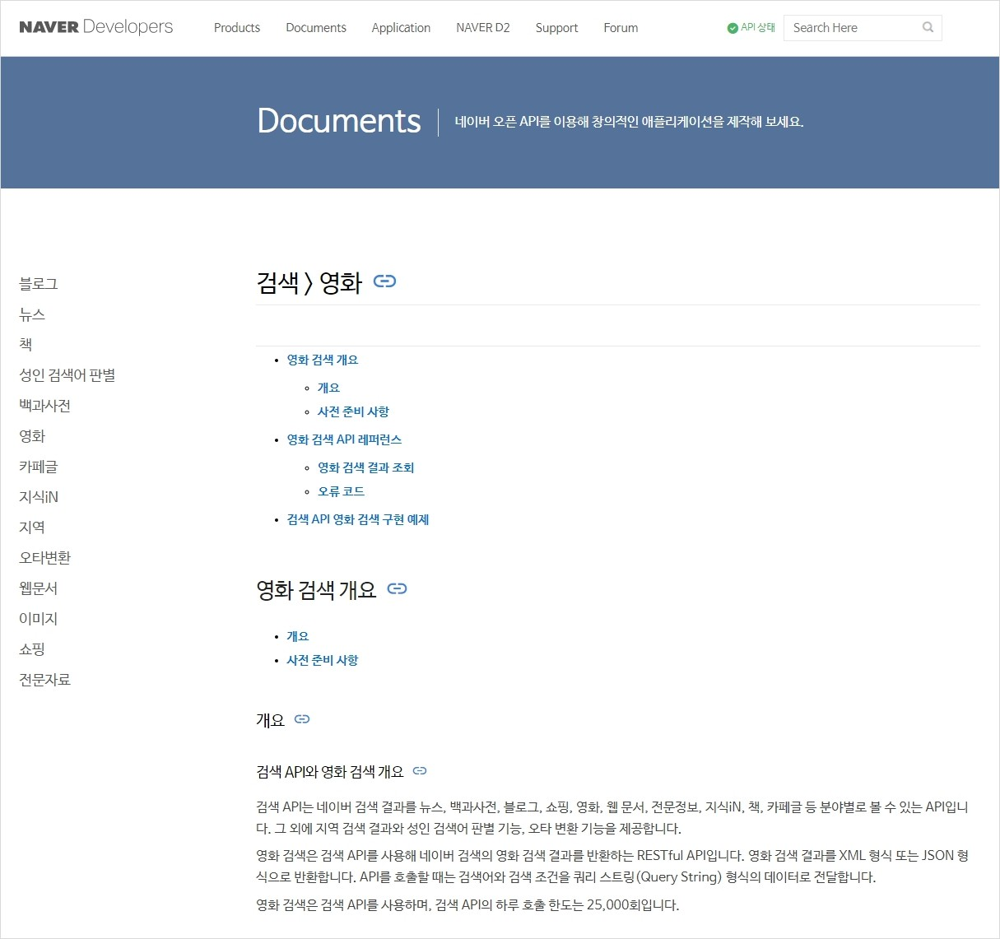
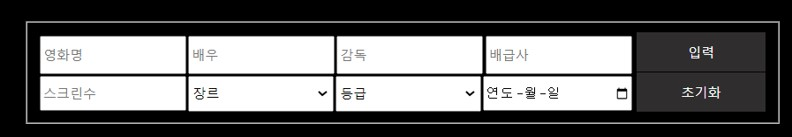

# Show Me The Credit!💰   

### 팀 소개
|구분|이름|내용|
|:--:|:--:|--|
|팀명||5OS(오링스)|
|팀원||안태현, 오성진, 오수연, 유정현, 이예지|
|역할|안태현|데이터 수집 및 기초 전처리, 딥러닝 (회귀) 모델 선정 및 학습,  파라미터 조정, 웹구현(js)|
||오성진|데이터 전처리, 딥러닝 (회귀) 모델 선정 및 파라미터 조정,  웹구현(HTML)|
||오수연|데이터 전처리, 점수화, 딥러닝 (회귀, 분류) 모델 선정 및  파라미터 조정, 보고서 작성|
||유정현|데이터 전처리, 점수화, 딥러닝 (회귀, 분류) 모델 선정 및  파라미터 조정, 보고서 작성|
||이예지|추가 분석용 웹 크롤링, 크롤링 데이터 전처리,  딥러닝 (분류) 모델 선정 및 파라미터 조정, 보고서 작성|

### data 설명
|순번|파일명(/final/0_data/)|설명|
|:--:|--|--|
|1|KOBIS_개봉일람_2023-03-23.csv|KOBIS 개봉일람(연도별) 2003년~2023년  영화 정보 데이터(2023-03-23 기준)|
|2|preprocessing.csv|누락 데이터 제외, 컬럼별 전처리, 데이터 타입  변경된 파일|
|3|naver_crawling_data.csv|네이버 영화 API에서 크롤링으로 배우, 평점,  네이버 영화 url 추가 수집한 파일|
|4|resizing_all.csv|‘전국 스크린 수’ 50 초과, ‘전국 관객수’ 1,000명 초과 /  연도별 ‘총 관객수’, ‘코로나’ 컬럼 추가 (4168개 데이터)|
|5|resizing_reg.csv|‘전국 스크린 수’ 50 초과, ‘전국 관객수’ 10,000명 초과  100,000명 미만의 데이터 / 연도별 ‘총 관객수’, ‘코로나’  컬럼 추가 (1603개 데이터)|
|6|resizing_cls.csv|‘전국 스크린 수’ 50 초과, ‘전국 관객수’ 800,000명 초과하는 데이터 /  연도별 ‘총 관객수’, ‘코로나’ 컬럼 추가 (744개 데이터)|
|7|movie_resize_merged_all.csv|resizing_all.csv파일과 크롤링 파일을 합친 파일|
|8|movie_resize_merged_reg.csv|resizing_reg.csv파일과 크롤링 파일을 합친 파일|
|9|movie_resize_merged_cls.csv|resizing_cls.csv파일과 크롤링 파일을 합친 파일|
|10|movie_resize_ranking.csv|movie_resize_merged_all.csv파일에서  ‘전국 관객수’ 기준 상위 300개 데이터|
|11|movie_total_people.csv|연도별 ‘총 관객수’ 데이터|
|12|movie_final_reg.csv|movie_resize_merged_reg.csv파일에서 ‘감독’, ‘배급사’, ‘주연배우’  점수화 컬럼을 추가한 회귀 학습용 최종 파일 (1413개 데이터)|
|13|movie_final_cls.csv|movie_resize_merged_cls.csv파일에서 ‘감독’, ‘배급사’, ‘주연배우’  점수화 컬럼을 추가한 분류 학습용 최종 파일 (708개 데이터)|
|14|DL model/cls_model.h5, reg_model.h5|분류 모델(cls_model.h5)과  회귀 모델(reg_model.h5)을 학습시킨 모델링 파일|
|15|requirements.txt|install이 필요한 모듈&모듈 버전 리스트|

---
## 목차
Ⅰ.　 [[프로젝트 소개]](#1-프로젝트-소개)   
Ⅱ.　 [[프로젝트 전 과정]](#2-프로젝트-전-과정)   
　0. [　Data Collecting](#0-data-collecting)   
　1. [　Data Preprocessing](#1-data-preprocessing)   
　2. [　Data Resizing](#2-data-resizing)   
　3. [　Data Merge with crawling data](#3-data-merge-with-crawling-data)   
　4. [　Modeling and Fitting](#4-modeling-and-fitting)   
　5. [　Summary (평가 및 최종결과)](#5-summary-평가-및-최종결과)   
　6. [　Conclusion(한계 및 보완점)](#6-conclusion-한계-및-보완점)   
　7. [　참고: Git Hub](#7-참고-git-hub)   
　8. [　Web Implementation](#8-web-implementation)   

---
## 1. 프로젝트 소개 
   
### 　1) 주제
　　국내 개봉 영화 데이터를 활용한 영화 관람객수 예측 DL모델 개발   
   
### 　2) 배경
　　(1) 영화 산업은 지속적인 성장을 거듭하며 2019년 매출액 2조 5093억 원의 최고 수준을 기록함.   
　　(2) Covid-19의 확산으로 2020년 매출액 전년 대비 58% 감소하며 지난 10년 간 가장 적은 규모를 보임.   
　　(3) 2022년 한국 영화산업 결산 보고서에 따르면 매출액과 전체 관객 수 모두 회복세에 접어들었음.   
　　(4) 코로나19 팬데믹으로 3년간 침체된 영화산업의 성장을 기대하며 어떤 요소들이 영화 흥행에 영향을 주는지 알아보고자 함.   
  
 　　
   
### 　3) 목적 및 기대효과
　　(1) 영화 투자자의 관점에서, 영화가 개봉되었을 때 기대되는 수익에 대해 합리적인 기준이 있다면 투자 규모 등의 중요한 의사 결정을 내릴 때 도움이 될 것.   
　　(2) 머신러닝/딥러닝을 통해 영화 관람객 수 예측 모델을 도출함으로써, 영화 투자사에 가이드라인을 제시할 수 있고, 영화 제작사의 입장에서는 영화 투자 제안 및 홍보에 전략적 수단이 될 것이라 기대함.   
　　(3) 소비자의 입장에서 흥행 가능성이 높은 작품을 확인함으로써 관람 전 기대감을 높이고 관람 후 만족도가 상승할 것으로 기대함.   
   
### 　4) 프로젝트 수행기간
　　2023년 4월 3일 ~ 2023년 4월 7일   
   
### 　5) 프로젝트 참여 구성인원
　　안태현, 오성진, 오수연, 유정현, 이예지   
   
### 　6) 개발환경
　　(1) 시스템 : VSCode, jupyter notebook, Google colaboratory   
　　(2) 언어 : Python, HTML, CSS, JavaScript   
　　(3) 라이브러리 : Cmake, BeautifulSoup4, Pandas, Pandas-profiling,  Numpy, Numpydoc,  Matplotlib, Seaborn, Sklearn(Scikit-Learn), Tensorflow, TensorJs, Urllib, Xmltodict   
　　(4) 알고리즘 : DNN(Deep Neural Network), Batch Normalization   
   
---
## 2. 프로젝트 전 과정
   
### 　0. Data Collecting
　　KOBIS 공식 통계 자료: 연도별 영화 정보 및 통계 데이터   
　　https://www.kobis.or.kr/kobis/business/stat/offc/searchOfficHitTotList.do?searchMode=year   

　　   
      
　　네이버 API 영화 데이터 크롤링: 배우, 평점, 네이버 영화 정보 url 데이터 추가 수집   
　　https://developers.naver.com/docs/serviceapi/search/movie/movie.md   

　　   
   
### 　1. Data Preprocessing
#### 　　1) 데이터 불러오기    
　　사용 데이터: KOBIS_개봉일람_2023-03-23.csv   
　　KOBIS 개봉일람(연도별) 공식 통계 사용(2003~2023년 데이터)   
   
#### 　　2) 데이터 전처리하기 
##### 　　　(1) 데이터 정보 확인하기    
　　컬럼별 null값 확인하기, 데이터 타입확인하기   
   
##### 　　　(2) 결측치 데이터 처리하기 
　　제작사, 수입사 결측치가 매우 많아 데이터 drop, 나머지 컬럼의 결측치는 기타로 변경    
   
##### 　　　(3) 범주형 데이터 처리하기    
　　상관 관계가 높은 데이터 컬럼을 주요 변수로 선택해 사용   
　　'감독' : 감독이 여러 명인 경우 첫번째 감독을 사용   
　　'배급사' : 배급사가 여럿인 경우 첫번째 배급사를 사용   
　　'영화유형' : ‘개봉영화’ 한 가지로 컬럼 삭제   
　　'등급' : 전체, 12세, 15세, 청소년관람불가  총 4가지 등급을 사용, 18세 관람가, 청소년제한상영가는 청소년관람불가에 포함시킴   
   
　　   
   
##### 　　　(4) 수치형 데이터 처리하기
　　‘전국 매출액’, ‘스크린 수’, ‘관객수’ 확인을 위해 integer 타입으로 변경   

### 　2. Data Resizing
#### 　　1) 전처리된 파일 불러오기 
　　df = pd.read_csv('../0_data/preprocessing.csv',encoding='utf-8')   
   
#### 　　2) 데이터 리사이징 
##### 　　　(1) 데이터 분포 확인    
　　pr_report.html : 프로파일링 리포트를 확인 후 매우 편향된 데이터를 확인함    

　　   
   
##### 　　　(2) 전국 관객수를 기준으로 데이터 분리 
　　movie_resize_ALL : 관객수 1000명 초과, 전국 스크린수 50 초과    
　　movie_resize_회귀 : 관객수 10000명 초과, 관객수 100000 미만 전국 스크린수 50 초과    
　　movie_resize_분류 : 관객수 800000명 초과, 전국 스크린수 50 초과   
   
##### 　　　(3) 배급사 데이터 변경
　　동일한 배급사이지만 회사명이 바뀌었거나 표기명이 바뀐 데이터들을 통일된 하나의 배급사명으로 정리    
   
##### 　　　(4) 국적 데이터 변경 
　　국적 데이터 중 데이터 갯수가 300 이하인 국적은 기타로 변경, 309개인 독일 까지사용    
　　['미국', '한국', '일본', '영국', '프랑스', '중국', '독일', ‘기타']    

##### 　　　(5) 계절 컬럼 추가 
　　‘개봉일' 데이터 타입을 datetime으로 변경 후 ‘연도'와 ‘월' 데이터 추출하기    
　　‘월’ 데이터를 이용하여 ‘계절’ 컬럼 추가   
   
##### 　　　(6) 총 관객수 컬럼 추가 
　　movie_total_people.csv : KOBIS 공식통계 총 관객수 및 매출액(연도별) 데이터에서 일부를 발췌   
　　https://www.kobis.or.kr/kobis/business/stat/them/findYearlyTotalList.do   
   
　　movie_total_people['관객수'] 데이터 타입을 정수형으로 변환 후,    
　　movie_resize에 [‘총 관객수'] 컬럼을 추가. movie_resize 데이터에 각 행별 [‘연도']에 해당하는 [‘관객수']를 추가    
　　* 2023년의 경우 2022 데이터로 대체   
   
##### 　　　(7) 코로나 컬럼 추가 
　　[‘연도’] 컬럼을 이용하여 코로나 기간과 아닌 기간을 구분   
　　* 2020년~2022년 코로나 기간 : 1 / 나머지 : 0   
   
### 　3. Data Merge with crawling data
#### 　　1) 크롤링 데이터 합치기    
##### 　　　(1) resize된 데이터 불러오기    
　　pd.read_csv('../0_data/resizing_all.csv',encoding='utf-8')   
　　pd.read_csv('../0_data/resizing_reg.csv',encoding='utf-8')   
　　pd.read_csv('../0_data/resizing_cls.csv',encoding='utf-8')   
     
##### 　　　(2) 크롤링 파일 불러오기 
　　df2 = pd.read_csv("../0_data/naver_crawling_data.csv", encoding='UTF-8',index_col=0)   
　　불러온 파일에서 필요없는 '네이버URL' ,'이미지URL', '제작연도', '감독', '연도' 컬럼을 drop   
   
##### 　　　(3) 빈칸 데이터 삭제하기 
　　[‘출연'] 컬럼에서 null 값이 아닌 데이터만 사용.   
   
##### 　　　(4) movie_resize 데이터와 크롤링 데이터(df2) merge  
　　‘영화명을 기준으로 movie_resize 데이터에  df2 데이터를 합침.    
   
##### 　　　(5) 중복 데이터 삭제 후 새로운 movie_resize_merged_.csv 생성   
　　‘영화명'을 기준으로 중복되는 행의 첫번째 값은 두고 나머지를 삭제    

#### 　　2) Top 300 데이터 생성
##### 　　　(1) 합쳐진 데이터 불러오기   
　　pd.read_csv('../0_data/movie_resize_merged_all.csv',encoding='utf-8')    
   
##### 　　　(2) movie_resize_ranking.csv 생성   
　　'영화명', '감독', '배급사', '개봉일', '출연' 5개 컬럼 데이터를 사용.   
　　전국 관객수 기준으로 내림차순 300개의 데이터를 취합      
    
#### 　　3) 특정 독립변수 추가 및 점수화 
##### 　　　(1) 합쳐진 데이터 불러오기 
　　pd.read_csv('../0_data/movie_resize_merged_all.csv',encoding='utf-8')   
　　pd.read_csv('../0_data/movie_resize_merged_reg.csv',encoding='utf-8')   
　　pd.read_csv('../0_data/movie_resize_merged_cls.csv',encoding='utf-8')   
    
##### 　　　(2) 점수화행 만들기 
　　movie_resize_merged 데이터에서 ['개봉일'] 데이터 타입을 datetime64로 바꿔줌   
　　점수화 과정에서 해당 영화의 개봉일보다 이전의 영화들의 순위를 가지고 비교하려고 하기 때문   
      
　　movie_final_에 ['감독_흥행', '배급사_흥행', '주연배우_흥행'] 컬럼 추가하기   
　　(movie_final_ 변수에 이전 까지 사용하던 movie_resize_내용을 복사했음)   
      
##### 　　　(3) 감독, 배급사, 출연(배우) 점수화 하기_회귀/분류 모델 적용
　　movie_resize_ranking.csv에서 해당 영화의 개봉일 보다 이전에    
　　{감독 or 배급사 or 출연(배우)} top300 영화에 있었으면 그 순위에 따라 해당 영화에 점수를 부여   
　　‘주연배우_흥행’의 경우 여러명의 배우가 300위 순위에 있으면 점수화된 각 값들을 더해줌   
     
|구간 (Top300 순위 = directors index)|점수|
|--|--|
|300~271|1|
|210~241|2|
|240~211|3|
|210~181|4|
|180~151|5|
|150~121|6|
|120~91|7|
|90~61|8|
|60~31|9|
|30~1|10|

##### 　　　(4) movie_final_reg.csv, movie_final_cls.csv 최종 데이터 생성
　　movie_final_회귀.to_csv('./movie_final_reg.csv',encoding='utf-8')   
　　movie_final_분류.to_csv('./movie_final_cls.csv',encoding='utf-8')   
    
### 　4. Modeling and Fitting
#### 　　1) 회귀 모델
##### 　　　(1) 최종 전처리 데이터 불러오기
　　‘전국 스크린수’ 50개 초과하고 ‘전국 관객수’ 10,000명 초과, 100,000 미만인 데이터     
   
##### 　　　(2) 데이터 스케일링
　　RobustScaler 모듈을 사용하여 : ‘전국 스크린수’, (연도별) ‘총 관객수’ 데이터를 스케일링    
    
##### 　　　(3) 라벨링
　　‘영화형태’, ‘국적’, ‘장르’, ‘등급’, ‘영화구분’, ‘계절’ 컬럼의 데이터를 라벨로 지정해, 범주형 자료를 딥러닝에 사용할 수 있도록 함   

##### 　　　(4) 데이터 슬라이싱 
　　훈련 세트, 검증 세트, 테스트 세트로 데이터 분할    
　　(1) 2023년 데이터를 테스트 세트로 분리    
　　(2) 2003~2022 데이터 중 25%를 검증 세트로 분리   
　　(3) ‘전국 관객수’ 컬럼을 종속 변수로 분리   
    
##### 　　　(5) 모델 구조 만들기
　　(1) 은닉층 3개, 은닉층 각 유닛 수 90, 활성화 함수 ‘swish’, dropout 0.2 적용하여 모델 생성   
　　(2) 옵티마이저 Adagrad, 학습률 0.9, epsilon=1e-6으로 설정     
　　(3) 손실 함수는 ‘mae’로 하여 모델 컴파일   

　　    
   
##### 　　　(6) 모델 학습시키기
　　훈련 세트로 회귀 모델 학습, 검증 세트로 검증했을 때 손실 그래프 결과 확인   

　　   

##### 　　　(7) 학습된 모델을 사용하여 예측 수행
　　테스트 세트의 독립 변수를 사용하여 예측했을 때, 종속 변수(‘전국 관객수’)와 차이가 20% 이내인 예측 결과를 예측에 성공한 것으로 보고 예측 성공률 확인   
　　2023년 데이터 19개 중 13개에 대해 예측 성공 : 13/19 = 0.68   

#### 　　2) 분류 모델
##### 　　　(1) 최종 전처리 데이터 불러오기
　　‘전국 스크린수’ 50개 초과하고 ‘전국 관객수’ 800,000명 초과하는 데이터    
   
##### 　　　(2) 데이터 스케일링 
　　RobustScaler 모듈을 사용하여 : ‘전국 스크린수’, (연도별) ‘총 관객수’ 데이터를 스케일링    
   
##### 　　　(3) 라벨링
　　(1) ‘영화형태’, ‘국적’, ‘장르’, ‘등급’, ‘영화구분’, ‘계절’, ‘연도’ 컬럼의 데이터를 라벨로 지정해, 범주형 자료를 딥러닝에 사용할 수 있도록 함   
　　(2) 종속 변수인 ‘전국 관객수’ 컬럼을 구간별로 나누어 클래스로 변환   
　　전국 관객수 기준, [100만미만 / 100만이상 / 150만이상 / 300만이상 / 500만이상]으로 나누어 [0, 1, 2, 3, 4]로 라벨링   
   
##### 　　　(4) 데이터 슬라이싱
　　훈련 세트, 검증 세트, 테스트 세트로 데이터 분할   
　　(1) ‘전국 관객수’ 컬럼을 종속 변수로 분리   
　　(2) 전체 데이터 중 5%를 테스트 세트로 분리   
　　(3) 95%로 나뉜 훈련 세트 중 10%를 검증 세트로 분리   
     
##### 　　　(5) 모델 구조 만들기
　　(1) 하이퍼파라미터 튜닝 결과: 유닛 수 256개, 레이어 수 5개, 학습률 0.006   
　　(2) 튜닝 결과를 적용하여 모델 생성: 은닉층 4개, 유닛 수 256개-128개-64개-32개, 출력층 유닛은 클래스 수인 5로 지정하고, 활성화 함수 ‘softmax’로 지정   
　　(3) 옵티마이저는 Adam, 학습률 0.006, 손실 함수는 ‘sparse_categorical_crossentropy’로 적용하여 컴파일   

　　    

##### 　　　(6) 모델 학습시키기
　　훈련 세트로 분류 모델 학습, 검증 세트로 검증했을 때 정확도 그래프 결과 확인   

　　   

##### 　　　(7) 학습된 모델을 사용하여 예측 수행
　　테스트 세트를 사용하여 예측했을 때, 정확도 50%    
　　즉, 테스트 세트에 대해 클래스를 정확하게 맞출 확률이 50%이며, 이는 5개 클래스의 무작위 확률인 20%보다 높은 수치.   
   
### 　5. Summary (평가 및 최종결과)
 　　기존 영화 관객수 예측 모델은 머신러닝을 이용하였으나, 더 다양한 요인을 포함하여 인공 신경망을 구성하고자 딥러닝을 이용하였다. 영화 정보를 입력하여 관객수를 예측하는 것을 목적으로 DNN 회귀 모델을 구성하여 학습한 모델로 예측을 실시해보았다. 그러나 종속 변수 데이터 분포의 불균형으로 인해 손실이 커, 종속 변수의 수치가 큰 데이터에 대해서 오차가 컸다.    
 　　이러한 문제에 대응하여 편차가 상대적으로 작은 데이터를 가지고 회귀 모델로 학습시키고, 편차가 큰 데이터는 종속 변수 데이터를 구간별로 나누어 분류 모델을 학습시켰다. 두 모델의 학습 후 모델 평가 결과, 회귀 모델의 경우 오차 범위를 20%로 정했을 때 정확도 약 68%, 분류 모델의 경우 정확도 약 50%를 나타내었다. 관객 수 예측을 위한 정확도로는 높지 못한 수준이지만, 무작위 예측 확률보다 높은 정확도를 도출해 내어, 영화의 감독, 주연배우, 배급사, 개봉 시기 등의 조건으로 관객 수를 예측할 수 있는 가능성을 제시하였다.   
   
### 　6. Conclusion (한계 및 보완점)
 　　우리가 사용한 데이터의 경우 적합한 딥러닝 모델이 제한적이라 적용시킨 모델에서 옵티마이저를 통한 성능 향상에만 집중하다보니 다양한 종류의 딥러닝 모델에 적용하지 못한 점이 한계로 남았다. 또한 딥러닝 이전 단계에서 머신러닝을 통해 적합한 레이어 층을 생성하고 이를 바탕으로 딥러닝 층에 적용시키고자 하였으나, 기술적인 한계로 인하여 적용하지 못하였다.    
 　　한편, 영화의 각 특성을 다양하게 조합해서 여러 예측 모델을 만든다면 영화 관객 수 예측의 주요 특성 도출을 기대할 수 있지만, 시간적인 한계로 인해 데이터가 가진 대부분의 특성을 포함한 모델 두 가지만을 생성하였다. 마지막으로, 누락된 데이터가 많아 학습에 사용한 데이터의 양이 적었고, 데이터의 편차가 커 정확한 예측을 위해 리사이징하는 과정에서 학습 데이터가 많이 손실었다. 그럼에도 불구하고 우연에 의한 확률보다 더 높은 정확도를 보였으므로, 정제된 빅데이터를 활용한다면 더 정확한 예측을 보여줄 것으로 기대된다.   
   
### 　7. 참고: Git Hub   
https://github.com/Play-Web-miniProject/MovieDL.git   

### 　8. Web Implementation
#### 　　1) 웹 구현을 위한 사전 작업
　　h5 모델 저장 - 모델의 하이퍼 파라미터를 저장   
　　model.json 변경 - 웹상에서  tensor.js를 사용하여 모델을 사용하기 위해 json 파일로 변환   

#### 　　2) 레이아웃 구조

　　   

#### 　　3) 입력 받기
　　범주형 데이터(배우, 감독, 배급사, 장르, 등급)를 수치형으로 변환   
　　전국 스크린수는 스케일링 작업 진행   

　　   

#### 　　4) 결과 출력
　　각각의 변수를 받아 모델이 예측한 값이 500만 명 미만일 경우 회귀 모델을 적용하여 관객수를 출력하였으며, 500만 명 이상일 경우 분류 모델을 적용하여 결과를 출력하도록 함.   

